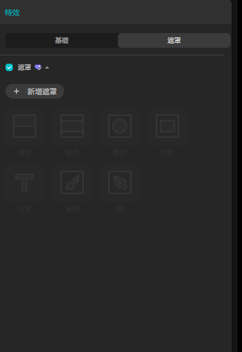
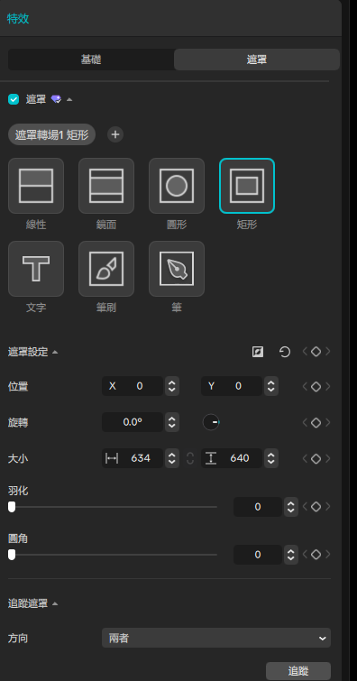
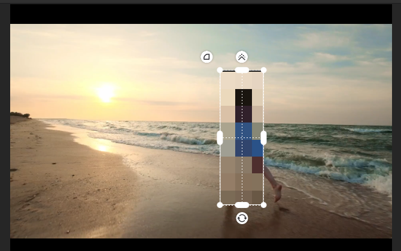
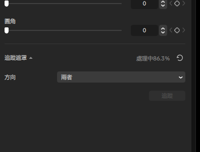
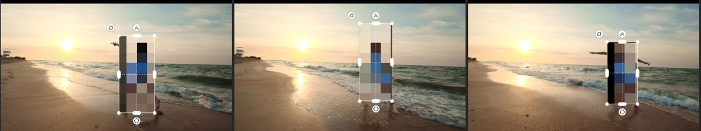
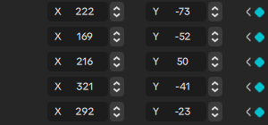

# 剪映電腦版：移動跟隨馬賽克（追蹤法）— Live Demo 複習筆記

Demo 日期：2026-08-15
教材來源：Bilibili BV18a4y1d7yx《电脑剪映移动跟随马赛克的2种制作方法》（磊哥知識分享，5:15）
CapCut 專案：`追蹤馬賽克-遮罩追蹤打碼`（原自動命名 `0815 (1)`）
留存格式：文字筆記＋截圖（依全域預設，不錄螢幕）

---

## Module 1 — 特效遮罩 + 自動追蹤

**涵蓋技巧**：素材資料庫取素材 → 馬賽克特效 → 特效遮罩（矩形）→ 遮罩定位 → 追蹤遮罩

### 操作步驟

1. **建立空白專案**：首頁 →「建立專案」（新專案預設命名為日期，事後在首頁右鍵卡片 →「重新命名」改成有意義的名稱）
2. **取素材**：左側 `資料庫` → 搜尋框輸入 `跑步` → 選第一筆「夕陽海灘奔跑」（29 秒 1080p）→ **慢速拖曳**到時間軸主軌
3. **加馬賽克特效**：`特效` 分頁 → 搜尋框輸入 **`mosaic`（英文）** → 拖曳「馬賽克」到主軌上方的特效軌
4. **對齊時間範圍**：拖曳特效右緣延長 → 再拖曳特效本體對齊影片起點（延長時起點不會自動回到 0，要另外拖）
5. **加遮罩**：選中特效 → 右側面板 `遮罩` 分頁 →「＋ 新增遮罩」→ 選 `矩形`
6. **定位遮罩**：`遮罩設定` 區塊用數值輸入 —— 大小 300×680、位置 X 220 / Y −32，讓方框罩住人物
7. **啟動追蹤**：捲到面板底部 `追蹤遮罩` → 方向 `兩者` → 按 **`追蹤`** → 進度顯示「處理中 xx%」，18 秒素材約 20–25 秒跑完
8. **驗證**：拖曳播放頭到不同時間點，觀察 `位置 X/Y` 數值逐格改變（數值變成關鍵影格色）

### 關鍵設定值

| 參數 | 值 |
| --- | --- |
| 素材 | 資料庫「跑步」第一筆，00:29:12，1920×1080 30fps |
| 特效 | 馬賽克（搜尋關鍵字 `mosaic`），模糊 50（預設） |
| 遮罩 | 矩形，大小 300 × 680，起始位置 X 220 / Y −32，羽化 0、圓角 0 |
| 追蹤方向 | 兩者（由目前影格往前＋往後同時追） |
| 特效涵蓋長度 | 約 18 秒（影片全長 29.5 秒） |

追蹤後實測的逐格遮罩座標（證明有寫入關鍵影格）：

| 時間點 | 位置 X | 位置 Y |
| --- | ---: | ---: |
| 0s | 222 | −73 |
| 5s | 169 | −52 |
| 10s | 216 | 50 |
| 15s | 321 | −41 |
| 19s | 292 | −23 |

### 關鍵結果截圖

### 講解逐字稿

> 接下來示範剪映電腦版的移動跟隨馬賽克。我會先開一個新專案，從素材資料庫拉一段有人物移動的影片，然後用追蹤功能，讓馬賽克自動跟著人物走。

> 遮罩已經框住人物。接下來按下追蹤按鈕，剪映會逐格分析畫面，讓這個馬賽克方框自動跟著人物移動，不需要手動打關鍵影格。

---

## 本次新踩到的坑（補充到 desktop-automation-lessons）

1. **右側屬性面板會卡在「詳細資料」**
   選中主軌影片素材時，右側面板一直顯示專案層級的「詳細資料」，不切換到素材屬性。
   `版面` 下拉切 `屬性`、`重設目前的版面` 都無效；UIA（pywinauto backend='uia'）對 CapCut
   只回傳 3 個空殼 Window，完全拿不到元件樹。
   **解法**：拖一個特效到時間軸並選中它，面板就會被喚醒；之後再點回影片素材，
   `影片 / 速度 / 插入動畫 / 調整 / AI 風格化` 分頁就正常出現了。屬於面板 stale 狀態，
   不是版面設定問題。

2. **特效庫的中文搜尋索引不完整**
   搜尋 `馬賽克` 回傳的是「大小多樣 / 超強銳化 / 弧形開幕」等無關結果；
   改搜英文 **`mosaic`** 才正確列出「馬賽克 / 馬賽克還原 / 藍色馬賽克 / 馬賽克閃震 / 馬賽克人物投影」。
   →「找不到某個特效」時先換英文關鍵字再說找不到。

3. **右上角兩顆圖示不是面板開關**
   `匯出` 左側那兩顆：第一顆（帶下拉箭頭）是 `版面`，第二顆是 **`快捷鍵`對話框**。
   誤點第二顆會彈出強制對焦的 modal，之後所有滑鼠點擊都會打在對話框上，
   造成「點了沒反應」的假象。點擊沒反應時先全視窗截圖確認有沒有 modal 蓋著。

4. **拖曳特效右緣延長，起點不會自動歸零**
   延長後特效仍停在原本的起始時間，必須再拖曳本體對齊素材起點。

5. **追蹤品質**：人物軀幹能穩定罩住，但大幅擺動的手臂會露出方框外。
   跟 memory 記的「跳躍式捲動追蹤延遲 39 格」相比，這種連續平移的真人素材追蹤是堪用的
   —— 追蹤失效的關鍵是「畫面跳躍」而不是「物體移動」。
