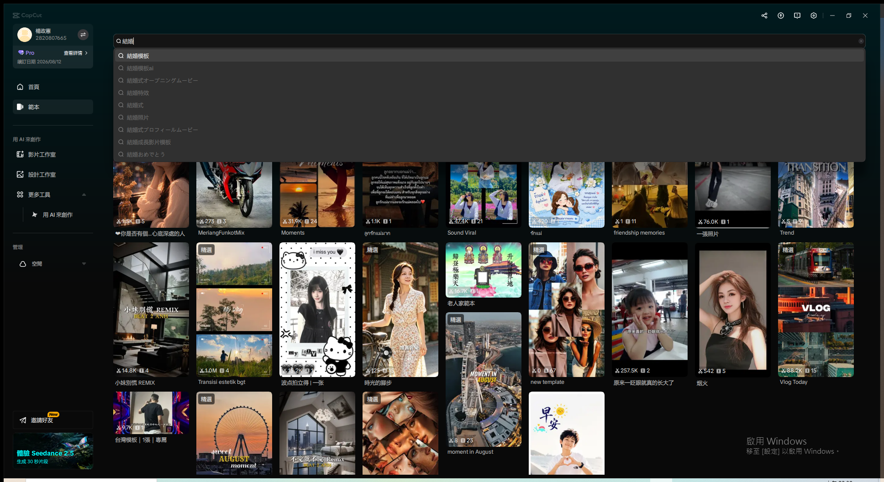
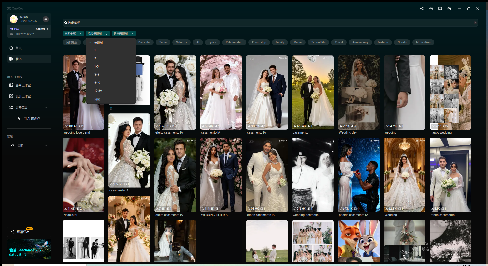
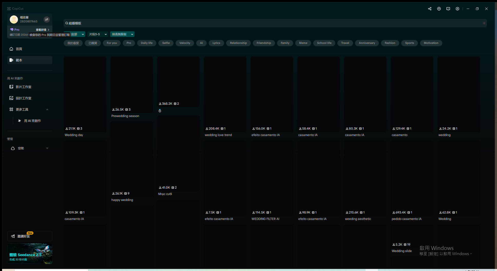
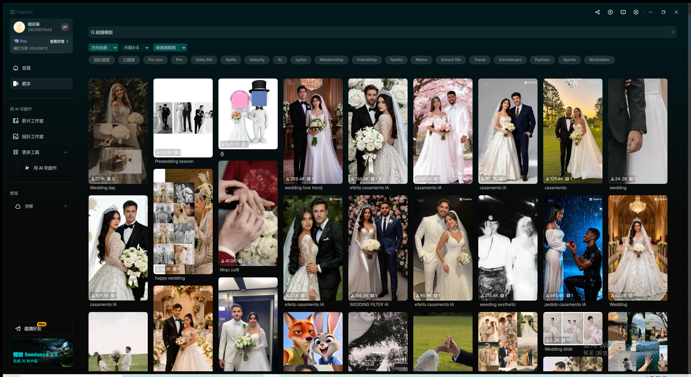
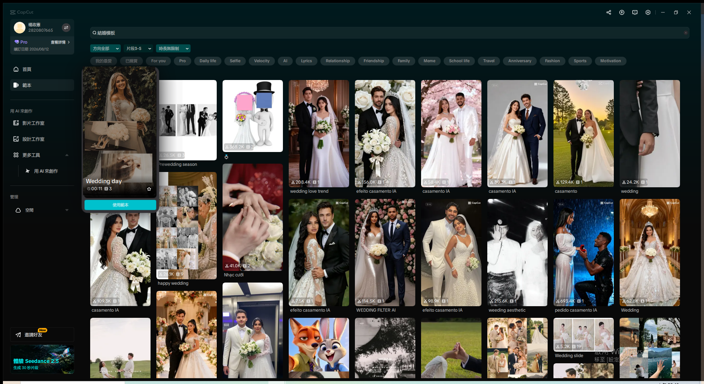
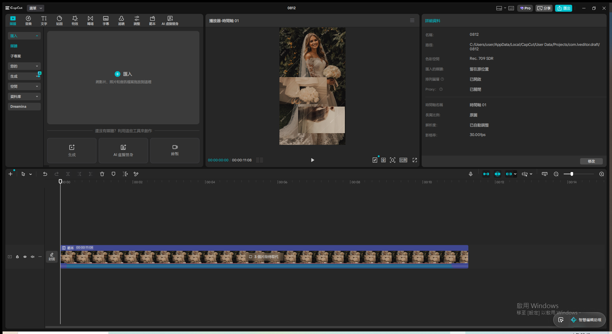
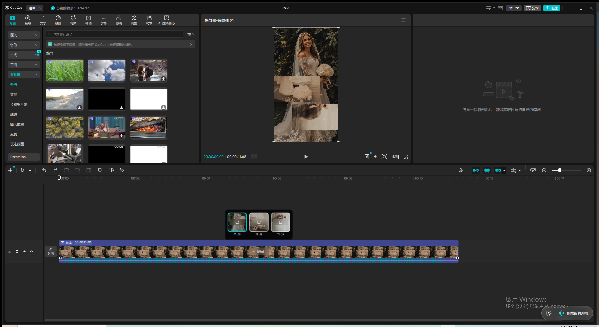
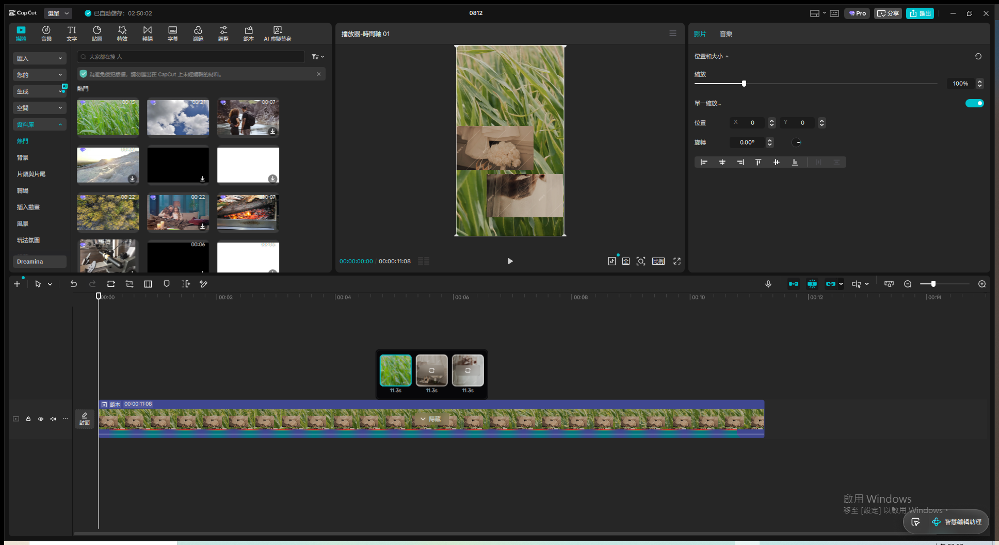
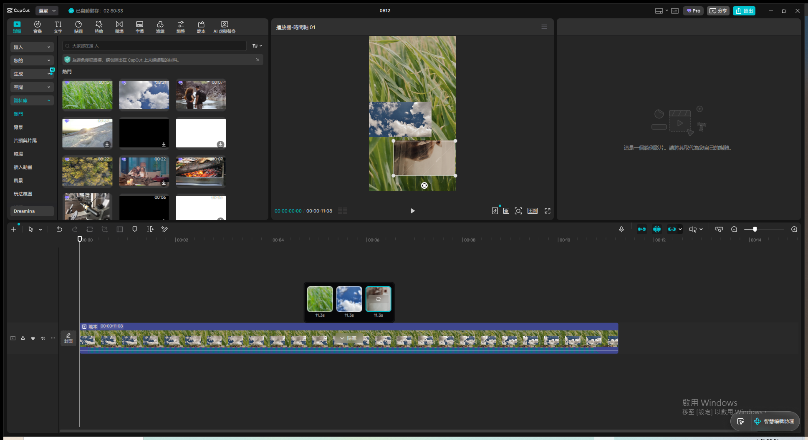
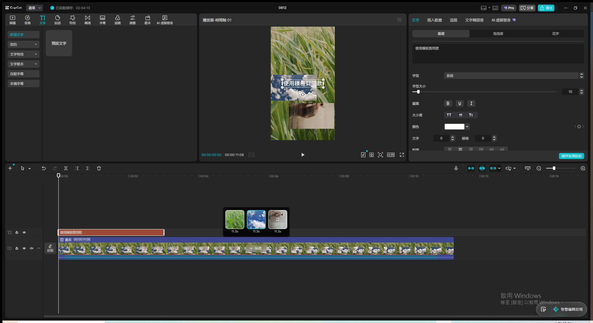

# 第2章：使用模板剪同款 — Live Demo 複習筆記

素材來源：`txt/03 第2章：使用模板剪同款.txt`（NotebookLM 語音摘要逐字稿）
Demo 日期：2026-08-12
CapCut 專案名稱：`模板剪同款-篩選懸停套用`

---

## Module 1 — 找到合適的模板

**涵蓋技巧**：分類瀏覽（12 種類別標籤）、關鍵字搜尋自動延伸建議

**操作步驟**：

1. 首頁左側導覽列點「範本」進入範本頁面
2. 畫面上方有一整排分類標籤：我的最愛／已購買／For you／Pro／Daily life／Selfie／
   Velocity／AI／Lyrics／Relationship／Friendship／Family／Meme／School life／Travel／
   Anniversary／Fashion／Sports／Motivation，對應逐字稿「大概十二種非常明確的分類瀏覽功能」
3. 在搜尋列輸入「結婚」，**不按 Enter**，下拉清單立即自動顯示延伸關鍵字建議：結婚模板、
   結婚模板ai、結婚式オープニングゲームービー、結婚特效、結婚式、結婚照片、
   結婚式プロフィールムービー、結婚成長影片模板、結婚おめでとう
4. 點選第一個建議「結婚模板」直接進入該關鍵字的搜尋結果，不用自己完整打完整句

**關鍵結果截圖**：

**講解逐字稿**：
> Module 一，找到合適的模板。剪映的模板庫非常龐大，我們可以透過畫面上方十二種分類標籤瀏覽，
> 或是直接用關鍵字搜尋，搜尋列會自動跳出常用的延伸關鍵字，幫我們快速收斂想法。

**踩坑記錄**：

- 範本瀏覽與搜尋是在 CapCut **首頁**的「範本」頁籤操作，不是在專案編輯器內；示範時要先
  「返回首頁」再點左側導覽「範本」，不要在編輯器裡面找。
- 搜尋框的自動延伸建議清單語系會混雜（本次出現日文「オープニングゲームービー」），這是
  CapCut 全球化模板庫的正常現象，不影響操作示範。

---

## Module 2 — 進階篩選條件

**涵蓋技巧**：比例（方向）篩選、模板時長篩選、片段數量篩選（新手最容易忽略但最重要）

**操作步驟**：

1. 承接 Module 1 的「結婚模板」搜尋結果，畫面上方有三個篩選下拉：「方向全部」（橫屏/直屏）、
   「片段無限制」（片段數量）、「時長無限制」（模板秒數長短）
2. 點開「片段無限制」下拉，選單完整呈現：無限制／1／2／1-3／3-5／5-10／10-20／自定，
   對應逐字稿「只要放一張照片的，或者是兩張 三到五張 甚至十一到二十張，你還可以自定義數量」
3. 選「3-5」→ 篩選 chip 立即變成「片段3-5」，搜尋結果同步重新整理，只剩下需要 3-5 個素材
   片段的婚禮模板

**關鍵設定值**：

- 片段數量篩選：3-5

**關鍵結果截圖**：

**講解逐字稿**：
> Module 二，進階篩選條件。找到模板的候選清單之後，畫面上方還有三個進階篩選：方向，也就是
> 橫屏或直屏；時長，模板的秒數長短；還有最容易被新手忽略、卻最重要的片段數量，也就是這個
> 模板需要幾張照片或幾段影片才能套用。

**踩坑記錄**：

- 三個篩選下拉（方向／片段／時長）UI 邏輯一致，點開後都是單一下拉選單、單選即套用，操作
  難度低，重點是**觀念**（片段數量對應逐字稿的「備料哲學」）而非操作複雜度。
- 篩選套用後縮圖會有短暫黑屏重新載入的狀態（正常現象，不是錯誤），示範時稍等 1-2 秒縮圖
  就會正常顯示。

---

## Module 3 — 讀懂模板資訊（懸停預覽機制）

**涵蓋技巧**：靜態縮圖資訊判讀（總使用量／所需片段數）、懸停動態預覽（總秒數）

**操作步驟**：

1. 滑鼠移開所有縮圖，確認「靜態」狀態：每張縮圖左下角固定顯示兩個數字徽章——一個是總使用量
   （例如「208.4K」），另一個是所需片段數（影片圖示 + 數字，例如「🎬1」「🎬3」）
2. 滑鼠移入「Wedding day」縮圖並停留 → 縮圖放大成懸停預覽卡片，開始動態播放模板實際效果，
   卡片下方同時顯示模板名稱「Wedding day」、總秒數「00:11」、所需片段數「🎬3」、以及一個
   「使用範本」按鈕
3. 對照逐字稿的備料觀念：這個模板需要 3 個素材片段、總長 11 秒，示範者應該在點下載前，先在
   自己電腦裡準備好剛好 3 張照片或影片片段

**關鍵設定值**：

- 示範模板：Wedding day（總秒數 00:11、所需片段數 3）

**關鍵結果截圖**：

**講解逐字稿**：
> Module 三，讀懂模板資訊。找到喜歡的模板之後，先別急著點下載。滑鼠還沒移入模板的時候，
> 縮圖上會靜態顯示這個模板的總使用量，還有一個關鍵數字，就是需要幾個素材片段。等滑鼠真的
> 移進去，畫面才會開始動態預覽實際效果，同時顯示這支影片的總秒數。先備好剛好數量的照片或
> 影片，才不會剪到一半才發現素材不夠。

**踩坑記錄**：

- 懸停預覽卡片會**放大並疊在其他縮圖上方**（z-index 提升），截圖時要注意卡片可能部分遮住
  右側/下方的其他縮圖，這是正常互動效果不是版面錯誤。
- 「使用範本」按鈕就位在這張懸停放大卡片內，不需要額外點回縮圖或另外找入口——確認素材數量
  之後可以直接在同一張卡片上點下載，跟 Module 4 的入口是同一個 UI 元件。

---

## Module 4 — 套用模板

**涵蓋技巧**：範本下載後匯入編輯器、素材取代方框、雙擊修改文字內容、拖曳調整文字位置

**操作步驟**：

1. 在 Module 3 的懸停放大卡片點「使用範本」→ 直接進入編輯器（沿用原本建立的空白專案），
   時間軸自動出現一條「範本」軌，長度 00:00:11:08，軌道上標示「3 個片段待取代」，播放器
   預覽畫面顯示三個範例素材方框（對應逐字稿「最下桑會有一格一格的方框」）
2. **正確的取代入口**：點擊時間軸範本軌上的「3 個片段待取代」文字 badge → 展開三張子片段
   小卡片（各 11.3 秒，都帶一個「取代」圖示），右側面板同時出現拖放區＋提示文字「這是一個
   範例影片。請將其取代為您自己的媒體」
3. 從左側「資料庫」（媒體庫）拖曳素材縮圖到展開的子片段小卡片上（不是拖到時間軸空白處！），
   依序完成前兩格取代（草地、雲朵），播放器畫面即時同步更新
4. 「文字」分頁 →「新增文字」→ 點「預設文字」卡片右下角的＋圖示 → 加入獨立文字圖層到時間軸
   （新增一條「TI」軌）
5. 對播放器畫面上的文字物件雙擊 → 進入編輯狀態 → `Ctrl+A` 全選、貼上剪貼簿新內容
   「使用模板剪同款」→ 點空白處確認，畫面與右側文字面板、時間軸標籤同步更新成新文字

**關鍵設定值**：

- 取代素材來源：CapCut 資料庫免費影片素材（草地、雲朵）
- 文字內容：預設文字 → 改為「使用模板剪同款」

**關鍵結果截圖**：

**講解逐字稿**：
> Module 四，套用模板。確認素材數量準備好之後，點下使用範本按鈕下載，進入編輯畫面，最下方
> 會看到一格一格的方框，那就是放置素材的專屬位置。從資料夾選好照片，依序拖曳到對應的方框裡
> 就完成串接了，放錯也可以直接用替換按鈕换掉。如果模板本身帶有文字，在預覽畫面上對文字點
> 兩下就能選取修改內容，位置也能直接用滑鼠拖曳調整。

**踩坑記錄（本次新發現，補進全域 lessons）**：

- **絕對不要把素材直接拖到時間軸範本軌的空白區域**（例如軌道上方）——這會觸發 CapCut「拖曳
  到空白處強制建立新軌」的既有機制（`desktop-automation-lessons.md` 已記錄過），結果是新增
  一條獨立素材軌疊加在範本軌上方，總長度暴增（本次從 11:08 變成 26:00），**不是**取代範本
  裡的方框。正確做法：先點擊軌道上的「N 個片段待取代」文字 badge 展開子片段小卡片，再把
  素材拖到**小卡片**上才是真正的取代。
- 子片段小卡片除了接受「內部拖曳」，**點擊卡片上的取代圖示本身也會直接開啟系統檔案總管**
  （Windows「選取媒體資源」對話框），這其實才是逐字稿描述「從你的電腦資料夾選取相片之後
  按下開啟」的原始對應操作——拖曳庫素材是本次示範用的替代做法（因為沒有使用者真實照片可用）。
  兩種入口殊途同歷，都能完成取代。
- 這次示範的模板本身沒有內建文字圖層（不是每個模板都有文字，這點對應逐字稿「如果模板本身
  帶有文字」的條件句），改用「新增文字」→「預設文字」額外加一條文字軌來完整示範雙擊修改
  技巧。
- 文字**內容**修改（雙擊 + Ctrl+A + 貼上）100% 成功；文字**位置**拖曳這次沒有生效（拖曳
  後文字位置未變，反而選取焦點跳到下方的範本片段）。懷疑是文字物件的可拖曳邊界判定與範本
  軌的方框邊界重疊互相搶焦點，之後若要示範純位置調整，建議用不含範本背景的空白畫布單獨測試
  文字圖層拖曳，避免物件邊界互相干擾。

---
