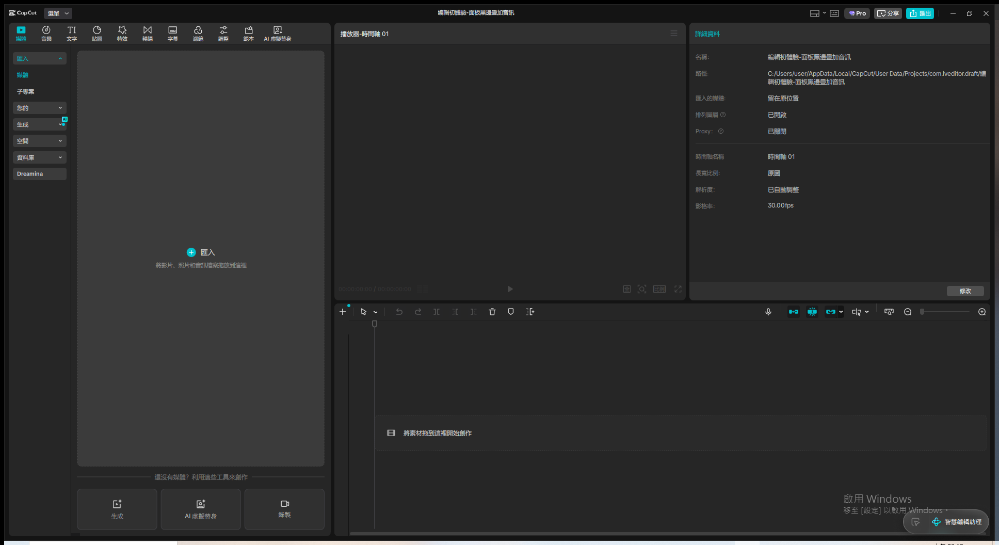
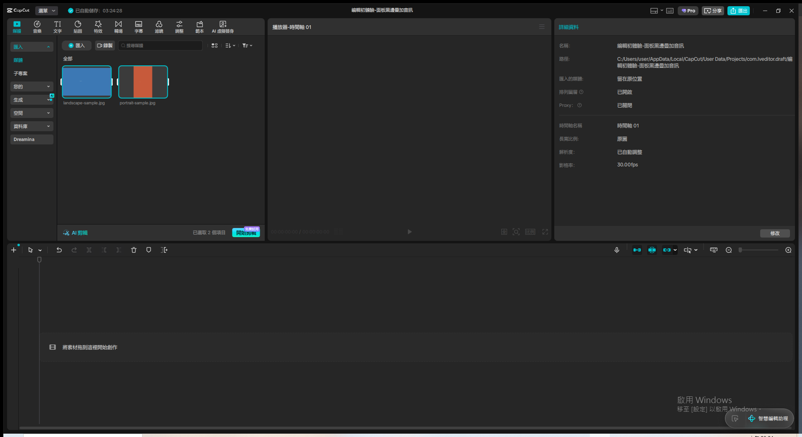
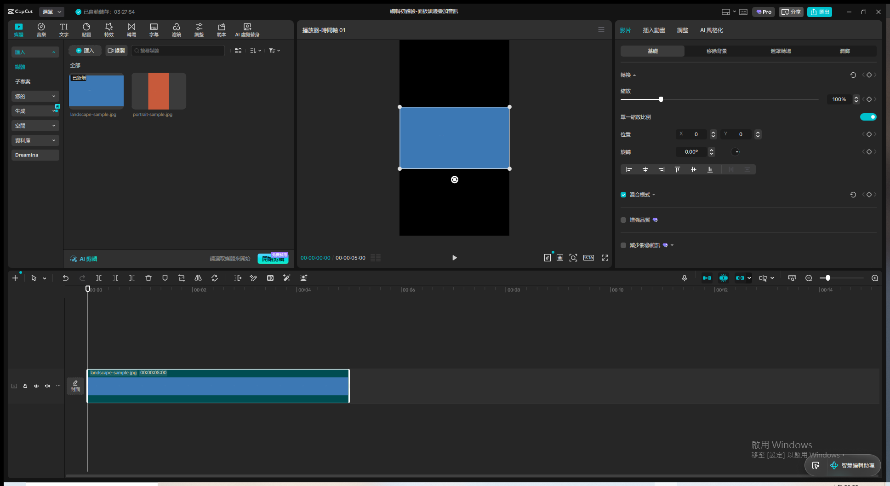
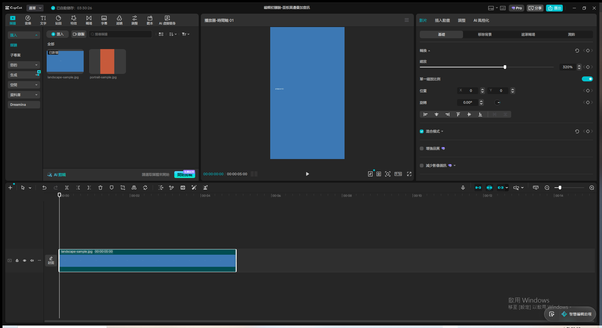
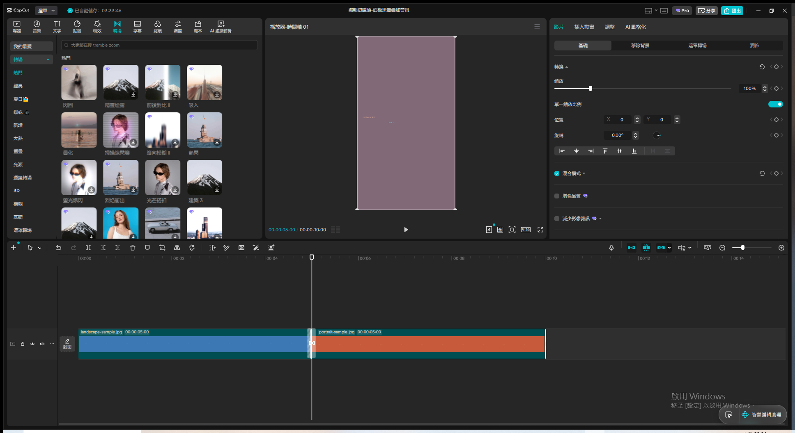
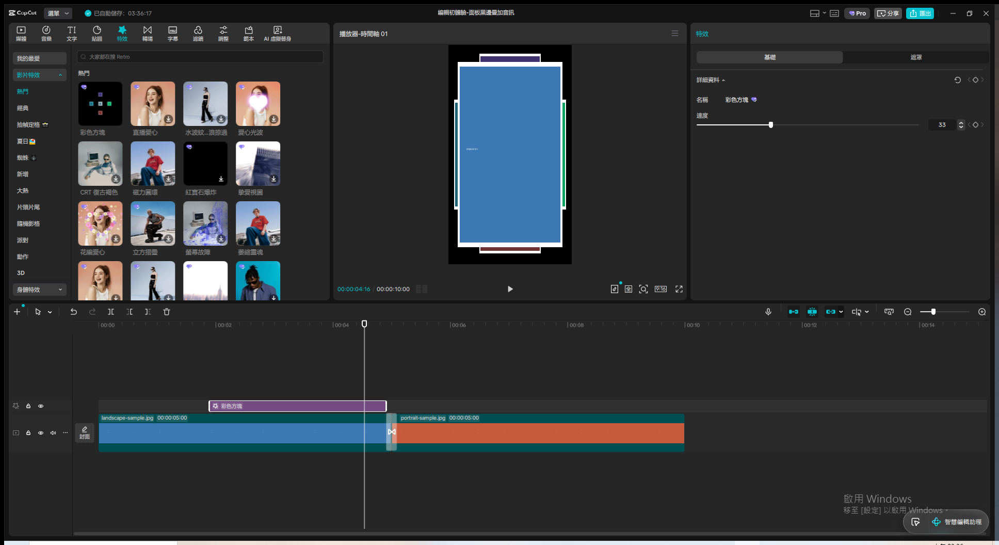
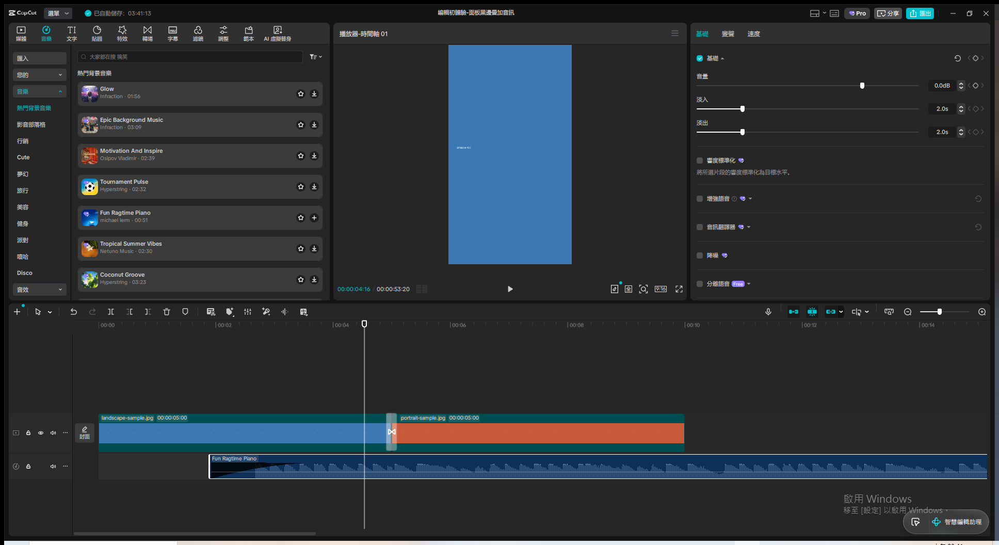
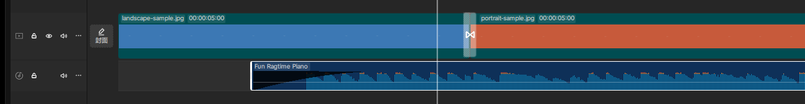

# 第4章：剪映編輯初體驗 — Live Demo 複習筆記

素材來源：`txt/05 第4章：剪映編輯初體驗.txt`（NotebookLM 語音摘要逐字稿）
Demo 日期：2026-08-12
CapCut 專案名稱：`編輯初體驗-面板黑邊疊加音訊`

---

## Module 1 — 認識工作室的四大面板與版面切換

**涵蓋技巧**：素材面板／播放器面板／時間線面板／功能面板的角色分工、動態版面切換

**操作步驟**：

1. 開啟空白專案，確認畫面自然分成四大塊：左上「素材面板」（媒體匯入區）、中間偏上「播放器」、
   下方一長條「時間線」、右上「詳細資料／功能面板」（選取片段後會變成調整參數用的面板）
2. 點畫面右上角版面切換圖示（工具列座標約 1580,25）→ 彈出選單：預設／媒體／屬性／垂直／
   重設目前的版面
3. 點「媒體」→ 左側素材面板明顯拉長變高（往下延伸吃掉播放器區域高度），對應逐字稿「篩選脫衣
   素材時需要大時間線／大素材區」的階段性需求
4. 示範完畢切回「預設」版面，恢復四塊平均分配的標準版面

**關鍵設定值**：

- 版面模式：預設／媒體／屬性／垂直（4 種可切換）

**關鍵結果截圖**：

**講解逐字稿**：
> Module 一，認識工作室的四大面板。剪映的介面主要分成四大塊：左上角的素材面板，就像你的黏土
> 倉庫，放所有原料；中間偏上的播放器面板，是你檢視作品的鏡子；下方那一長條的時間線面板，是你
> 真正動手黏黏土的工作臺；右上角的功能面板，則是你的雕刻刀跟工具箱，微調什麼都在那邊。這四個
> 區塊還可以動態調整比例，剪輯前期需要大時間線篩選素材，後期微調畫面時可以把播放器放到最大，
> 軟體會配合你當下的創作階段。

**踩坑記錄**：

- 版面切換選單藏在標題列右上角的一個小圖示（不是「選單」下拉的「版面」子選單，那個只是同名
  但要展開三層才到得了；直接點標題列圖示更快），選單彈出後四個選項是：預設／媒體／屬性／垂直
  （+ 重設目前的版面）。
- 「屬性」版面模式（放大右側功能面板）與「媒體」相對，對應逐字稿講的「後期微調顏色/特效邊緣
  時需要放大播放器」情境，本次示範只切了「媒體」一種，其餘模式使用者可自行切換體驗。

---

## Module 2 — 素材匯入與整理

**涵蓋技巧**：建立專屬資料夾集中素材、批次匯入到素材面板

**操作步驟**：

1. 先在電腦上建立一個示範用的專屬資料夾 `demo-assets/`，模擬「把這次會用到的素材集中起來」
   的整理動作（對應逐字稿「先把食材準備好」的概念）
2. 資料夾內放兩張示範用素材：`landscape-sample.jpg`（16:9 橫向）、`portrait-sample.jpg`
   （9:16 直向）——刻意準備一橫一直，是為了 Module 3 示範長寬比衝突（黑邊問題）鋪路
3. 點左側素材面板「匯入」按鈕 → 開啟系統檔案選取視窗 → 一次選取兩個檔案（用剪貼簿貼上完整
   路徑到檔名欄位，兩個路徑用空格分隔並各自加雙引號）→ 點「開啟」
4. 兩個素材同時出現在素材面板，確認匯入成功

**關鍵結果截圖**：

**講解逐字稿**：
> Module 二，素材匯入與整理。手機相簿常常是個數位垃圾廠，截圖、影片、廢片全部混在一起。建議
> 先在電腦上建立一個專屬資料夾，把這次會用到的影片、照片、音樂全部集中起來，再一口氣匯入剪映。
> 建立資料夾這個動作看起來很傳統，但這其實是建立秩序的第一步，因為當你進入剪輯的心流狀態時，
> 只要切換視窗東找西找一個遺失的檔案，專注力就會瞬間被打斷,嚴重破壞創作節奏。

**踩坑記錄**：

- 系統匯入對話框的副檔名篩選器預設是「Media files (*.mpg;*.f4v;*.mov...)」，但直接把完整
  路徑（含副檔名）貼進「檔案名稱」欄位，靜態圖片 `.jpg` 一樣能正確匯入，不受篩選器限制。
- 多檔匯入用「每個路徑各自加雙引號、用空格分隔」的格式貼進檔名欄位，一次可選取多個檔案，
  不用逐一匯入。

---

## Module 3 — 解決長寬比衝突的黑邊問題（直覺縮放）

**涵蓋技巧**：專案畫布長寬比切換、播放器預覽視窗直接拖曳縮放（所見即所得）

**操作步驟**：

1. 右側「詳細資料」面板點「修改」→ 開啟「專案設定」對話框 →「長寬比例」下拉選單 → 選「9:16」
   → 點「儲存」，畫布從「原圖」改成直式 9:16（畫面立刻變成黑色直式長條）
2. 把 `landscape-sample.jpg`（16:9 橫向）從素材面板拖到時間軸空白處，新增一條軌道
3. 播放器預覽畫面立即重現「長寬比衝突」：橫向素材置中顯示，上下兩側各出現一大塊黑邊，跟
   逐字稿描述的「兩條超級粗、超級醜的黑色邊框」完全一致 → 截圖存證「修正前」
4. 點選時間軸上的素材（自動選取），滑鼠移到播放器畫面上，素材四周會出現控制點
5. 按住**右下角控制點**、緩慢分段往外拖曳（多步移動，不要一次拖到底）→ 素材同步放大，右側
   功能面板「縮放」數值即時同步上升
6. 分好幾次拖曳／用縮放數值輸入框微調，從 100% 一路放大到 320% → 上下黑邊完全消失，畫面
   滿版填滿整個 9:16 畫布 → 截圖存證「修正後」

**關鍵設定值**：

- 畫布長寬比：9:16
- 素材最終縮放比例：320%（縮放輸入框可直接雙擊輸入數值微調，不用只靠拖曳）

**關鍵結果截圖**：

**講解逐字稿**：
> Module 三，解決長寬比衝突的黑邊問題。我們現在都習慣用手機直拍短影音，但難免會混到橫著拍的
> 照片或影片。當畫布是直式九比十六，丟進去的素材卻是橫向比例時，軟體為了不讓畫面變形，只能用
> 黑色色塊填滿剩下的空間，整支影片瞬間看起來像十年前的老舊產物。以前的解法是打開功能面板，
> 手動輸入X軸和Y軸的縮放數值,非常不直覺。現在的解法完全顛覆了這種數學邏輯:你只要在時間線上
> 選取有黑邊的素材，把滑鼠移到播放器預覽視窗，畫面四周就會出現控制點，直接按住角落往外拉，
> 畫面就放大了，黑邊直接消失。這就是所見即所得的設計,把抽象的數學運算轉化成你可以用物理直覺
> 操作的動作。

**踩坑記錄**：

- 拖曳控制點放大是**等比例縮放**（單一縮放比例開關預設開啟），一次拖曳幅度有限，實測需要
  分 3-4 段慢速拖曳（每段拖曳結束放開再重新按住）才能從 100% 拉到接近 300%，瞬間長距離拖曳
  容易被判定失敗或縮放量不準確，跟 `desktop-automation-lessons.md` 記載的拖曳踩坑一致。
- 拖曳到黑邊只剩極細一條時，改用**縮放數值輸入框**直接雙擊輸入精確數值（例如 320）比繼續
  用滑鼠拖曳更快更準——數值框改完後**點空白處確認、不要按 Enter**（Enter 會還原成拖曳前的
  舊值，是這份 skill 的已知全域踩坑）。
- 專案畫布比例的「修改」入口在右側「詳細資料」面板最下方的「修改」按鈕（不是選單列），開啟
  的是完整的「專案設定」對話框，長寬比例選單裡還有 16:9／4:3／2.35:1／1:1 等多種預設比例
  可選，不是只有 9:16。

---

## Module 4 — 疊加概念與非線性剪輯（轉場 vs 特效的空間邏輯）

**涵蓋技巧**：轉場放在兩段素材之間、特效以獨立圖層疊加、非破壞性編輯（刪除特效不影響原素材）

**操作步驟**：

1. 把 `portrait-sample.jpg` 拖到時間軸第一段素材右側，接續成兩段素材（同一軌道）
2. 點左上「轉場」分頁 → 從「熱門」分類拖曳「閃回」轉場縮圖到兩段素材的交界處
3. 因為兩段素材都只有 5 秒（片段太短），彈出提示「建立用於轉場的重複影格」→ 點「確定」讓
   CapCut 自動複製影格延長片段，保住轉場需要的長度 → 交界處出現轉場圖示，預覽畫面顯示兩段
   顏色融合的過渡效果，驗證「轉場＝放在兩段影片之間的時間緩衝」
4. 點左上「特效」分頁 → 從「熱門」分類選「彩色方塊」，**直接拖到已有素材的時間軸區域**（第
   一次示範）→ 特效被吸附合併進原本的素材片段裡（片段左上角出現「特效：彩色方塊 - 編輯中」
   標籤），不是獨立軌道 → Ctrl+Z 復原，改用第二種拖法重試
5. 把「彩色方塊」拖到**素材軌道正上方的空白區域**（而不是疊在素材縮圖上）→ 這次 CapCut 自動
   新增一條獨立的「特效」軌道，顯示一個紫色區塊懸浮在原本的影片軌道之上 → 播放器預覽同步
   顯示特效疊加後的畫面（原本純色畫面疊上一層半透明色塊分割效果），驗證逐字稿「特效是蓋在
   影片上的一張透明玻璃紙」
6. 點選特效軌道上的紫色區塊 → 按 `Delete` 鍵刪除 → 特效軌道完全消失，播放器畫面立刻回復成
   刪除前的純淨原始畫面，下方兩段素材與轉場完全沒有被影響，驗證「非破壞性編輯：反悔只要刪掉
   那張玻璃紙，不用重剪原始素材」

**關鍵設定值**：

- 轉場：閃回（熱門分類）
- 特效：彩色方塊（影片特效／熱門分類），速度預設 33

**關鍵結果截圖**：

**講解逐字稿**：
> Module 四，疊加概念與非線性剪輯。指南把轉場、特效、文字這三種東西的空間邏輯分得很清楚：
> 轉場是放在兩段影片之間，當作時間的緩衝，處理的是線性的時間流勢；而特效、貼紙、文字，則是
> 疊加在影片之上，觸及了現代影音編輯最核心的技術革命，也就是非線性剪輯。當你加上一個特效，
> 它並不是直接烙進你原本的影片裡面，軟體會在時間線上自動生成一個全新的、獨立的圖層，就像一
> 張透明玻璃紙直接蓋在原來的畫面上。這代表如果你想反悔，完全不需要重新剪輯那段影片，只要點
> 那張透明玻璃紙,把它刪掉就好,這種極高的容錯率,正是非線性剪輯賦予創作者的超能力。

**踩坑記錄**：

- 靜態圖片素材預設長度只有 5 秒，兩段串接後加轉場常常「片段太短無法用於轉場」，CapCut 會
  跳確認對話框問要不要「建立重複影格」延長片段配合轉場——直接點「確定」即可，不用手動先拉長
  片段時長。
- **特效拖曳落點決定了它是「合併進片段」還是「獨立圖層」**，這是本次示範最重要的踩坑發現：
  拖到素材縮圖正上方 → 合併成該片段的附加效果（片段左上角多一個「特效：XXX - 編輯中」標籤，
  沒有新軌道）；拖到素材軌道**上方的空白處** → 才會新增一條獨立的特效軌道，全域套用在底下
  所有素材上。要示範逐字稿講的「透明玻璃紙獨立圖層」概念，一定要用後者，前者示範效果不對。
- 特效軌道刪除後預覽畫面「立即」回復原狀、無殘留，是本次示範中最直觀驗證「非破壞性編輯」的
  一步，比對刪除前後的截圖差異即可完整說明容錯率的概念，不需要額外文字輔助。

---

## Module 5 — 音訊處理與淡入淡出（黑色三角形）

**涵蓋技巧**：從音樂庫匯入背景音樂、淡入／淡出秒數設定、音量自動化的視覺化呈現

**操作步驟**：

1. 點左上「音樂」分頁 → 進入「熱門背景音樂」清單（CapCut 內建免費曲庫）
2. 選「Fun Ragtime Piano」（00:51，時長適中方便示範）→ 拖曳縮圖到時間軸素材軌道下方的空白
   處，新增一條獨立的音訊軌，音軌上顯示完整波形圖
3. 點選音訊軌 → 右側功能面板自動切到「基礎」分頁，看到「音量」「淡入」「淡出」三個滑桿，
   淡入淡出預設都是 0.0s
4. 雙擊「淡入」數值輸入框、Ctrl+A 全選、貼上「2」、點面板空白處確認（不按 Enter）→ 淡入
   設為 2.0 秒；用同樣方式把「淡出」也設為 2.0 秒
5. 設定完成後，時間軸音訊軌波形圖的**最前端**立刻出現一個黑色三角形斜坡疊加在波形上，斜坡
   角度對應淡入速度，驗證逐字稿描述的「黑色三角形＝聲音變化的視覺化」→ 截圖存證

**關鍵設定值**：

- 背景音樂：Fun Ragtime Piano（michael lerm，CapCut 免費曲庫）
- 淡入：2.0s
- 淡出：2.0s

**關鍵結果截圖**：

**講解逐字稿**：
> Module 五，音訊處理與淡入淡出。我們可以從音訊標籤匯入喜歡的音樂，但當音樂長度跟影片不合時，
> 新手最常犯的錯誤就是直接拿剪刀工具把音樂卡擦切斷，這會導致影片結尾音樂突然啪一聲完全消失，
> 那個聽覺上的斷裂感會把觀眾瞬間從情緒裡抽離出來。剪映的介面設計給出了教科書等級的解決方案:
> 當你設定好淡入跟淡出的時間長度之後，音軌的前後兩端會出現一個小小的黑色三角形，那個三角形
> 的斜坡就代表聲音變小或變大的速度。這等於是把聽覺視覺化，讓完全不懂混音的人也能靠著眼睛，
> 做出很滑順的電影級結尾。

**踩坑記錄**：

- CapCut 內建「音樂」分頁的免費曲庫（熱門背景音樂／影音部落格／行銷／Cute／夢幻…等分類）
  可以直接拖曳試用，不需要另外下載真人語音素材——這個 Module 講的是背景配樂的音量曲線視覺化
  機制，不是語音內容本身，用免費曲庫完全足夠示範，不用照搬「音頻類技巧需要真人語音」的規則
  （那條規則是給「示範語音變聲/人聲分離」這類真的需要語音內容的情境用的）。
- 淡入／淡出的數值輸入框一樣適用「改完點空白處確認、不要按 Enter」的全域規則，這次雙數值
  （淡入、淡出各設一次）都各自獨立確認過，沒有互相覆蓋。
- 拖曳音樂縮圖到時間軸時，只要落點是在**素材軌道下方的空白處**就會自動生成新的音訊軌，不需要
  額外操作「新增軌道」——跟 Module 4 特效落點決定行為的邏輯一致，都是「拖到空白處＝新建軌道」。

---

## Module 6 — 模組化剪輯（觀念層，僅口頭講解，未實際操作）

**涵蓋概念**：長片拆分成獨立小專案分開剪輯、內容原子化、多平台分發策略

**說明方式**：本 Module 是策略／工作流層面的高階觀念，不對應 CapCut 裡任何單一按鈕操作（做法
是「開好幾個獨立專案分開剪」，而不是同一個專案裡的某個功能），因此本次 Demo 只用 TTS 口頭
講解逐字稿內容，不實際操作示範，直接口述帶過後進入收尾階段。

**講解逐字稿**：
> Module 六，模組化剪輯的高階策略。如果你剪的只是一支十五秒的短片，把所有素材塞進同一個時間
> 軸沒問題，但如果是二十分鐘的長片，指南建議把長影片拆分成好幾個獨立的小區塊，比如開場、觀點
> A、觀點B、結尾，分別在不同的專案裡剪輯，再各自匯出成小影片。這樣做的好處不只是降低修改時的
> 認知負荷,如果中間某個地方打錯字,你只需要開啟那個短短三分鐘的模組專案去修改,完全不用面對整條
> 長達二十分鐘的時間軸。更重要的是,這個策略簡直是為多平台分發量身打造的:你可以把完整的二十
> 分鐘影片放上YouTube,再把其中最精彩的一段單獨抽出來,發布在抖音或Instagram上,這就是所謂的
> 內容原子化,一次製作的精力,能產出好幾種適應不同平台演算法的產品。

---
