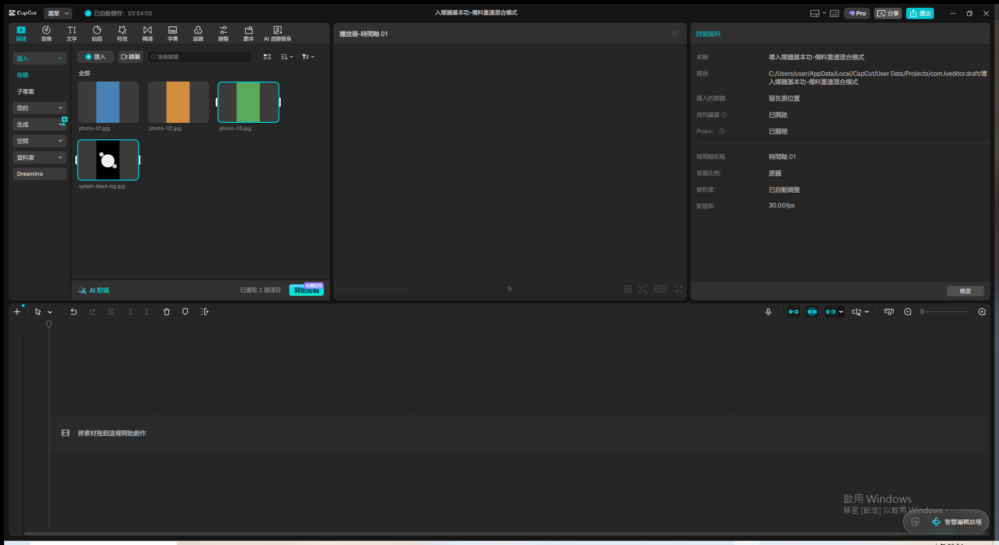
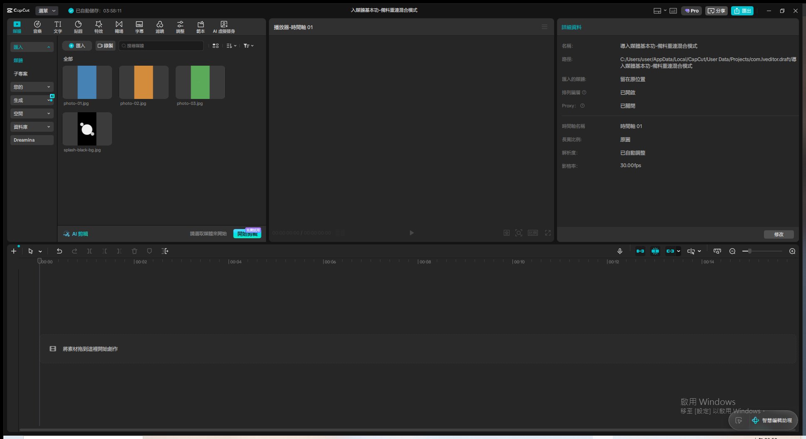
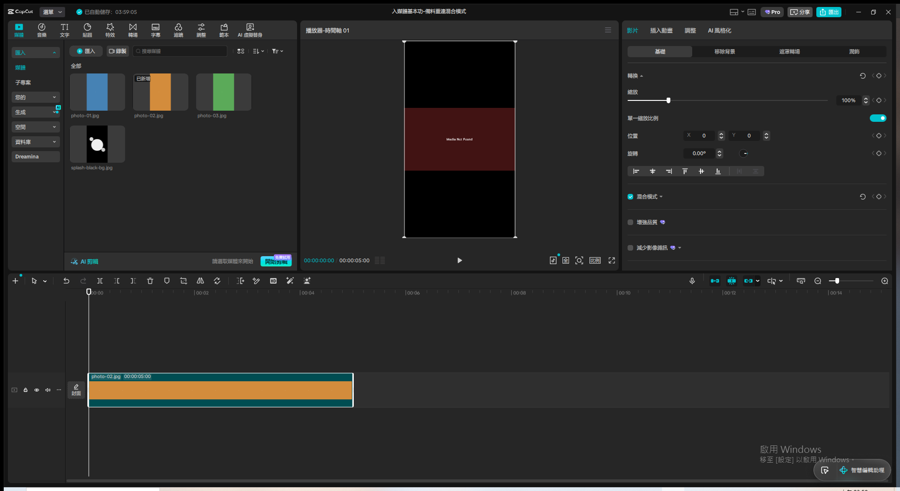
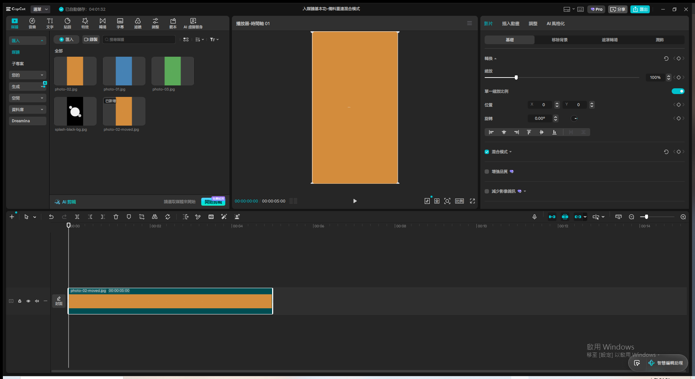
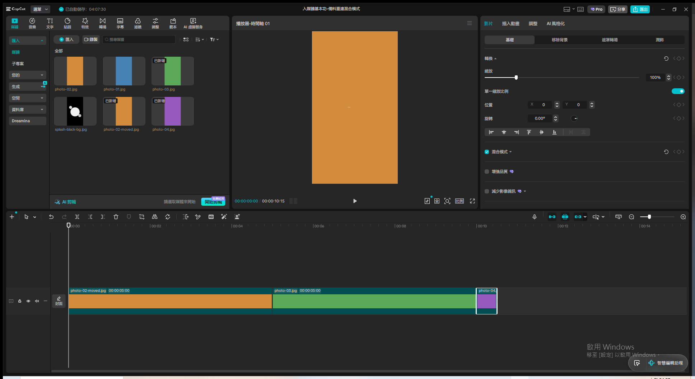
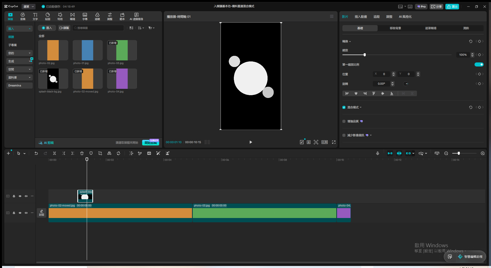
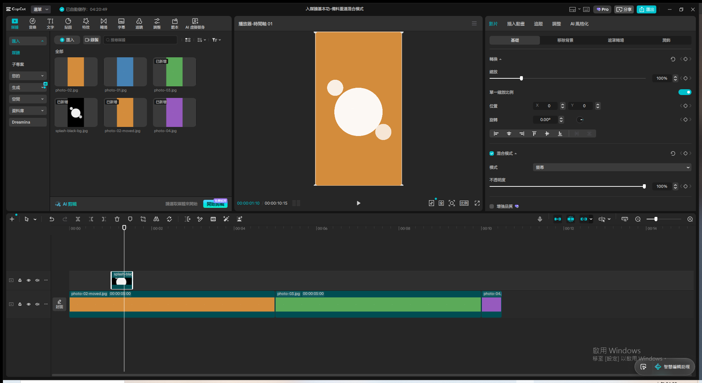

# 第5章：導入媒體基本功 — Live Demo 複習筆記

素材來源：`txt/06 第5章：導入媒體基本功.txt`（NotebookLM 語音摘要逐字稿）
Demo 日期：2026-08-12
CapCut 專案名稱：`導入媒體基本功-備料重連混合模式`

---

## Module 1 — 素材備料的黃金習慣（DCIM → Camera 資料夾 → 批次匯入）

**涵蓋技巧**：桌面專屬資料夾整理、批次匯入到素材面板

**操作步驟**：

1. 模擬「手機 DCIM → 電腦桌面 Camera 資料夾」的備料流程：先在本機建立示範用的
   `demo-assets/` 資料夾（對應逐字稿「桌面新增一個專屬資料夾，比如命名為 Camera」），把這次
   會用到的素材集中放進去，不直接從原始素材來源逐一拖拉
2. 資料夾內準備四個示範素材：`photo-01.jpg`（藍）、`photo-02.jpg`（橘）、`photo-03.jpg`
   （綠）——三張模擬手機隨手拍的照片，用於後續 Module 3 全域預設值示範；`splash-black-bg.jpg`
   （黑底白色潑墨形狀）——用於 Module 4 混合模式示範
3. 點素材面板「匯入」→ 選取多個檔案一次匯入（兩批各兩個檔案，因對話框單次貼上四個路徑只
   成功帶入前兩個，補做第二次匯入才補齊）→ 四個素材全數出現在素材面板

**關鍵結果截圖**：

**講解逐字稿**：
> Module 一，素材備料的黃金習慣。手機連上電腦時，你會看到一個叫做DCIM的資料夾，這個名字的
> 全名是Digital Camera Images，是1990年代就制定下來的通用標準。指南強調千萬不要直接從DCIM
> 裡面拉檔案進剪輯軟體，而是要先在電腦桌面上新增一個專屬資料夾，比如命名為Camera，把這次
> 要用的素材通通複製進去，再一口氣匯入。這就像頂級大廚在開火前的備料，法文叫做Mise en
> Place，把所有食材準備就緒，才不會在剪輯心流被打斷。

**踩坑記錄**：

- 系統匯入對話框一次貼上 4 個雙引號分隔的檔案路徑時，實測只有前 2 個被選中（原因不明，可能
  是對話框內部路徑字數或項目數限制），分兩批各貼 2 個路徑反而穩定成功。之後遇到多檔匯入建議
  以 2-3 個檔案為一批，不要一次塞太多路徑。
- 本章示範的「Camera 備料資料夾」用 repo 內的 `demo-assets/` 資料夾代替真實桌面資料夾，概念
  等價（集中素材、批次匯入），不影響教學效果。

---

## Module 2 — 非破壞性編輯與媒體重新連結（Media Not Found）

**涵蓋技巧**：時間軸刪除片段不影響原始檔案、模擬素材搬移觸發 Media Not Found、用「取代片段」
重新連結

**操作步驟**：

1. **驗證非破壞性編輯**：把 `photo-01.jpg` 拖到時間軸 → 選取該片段按 `Delete` 刪除 → 時間軸
   清空，但左側素材面板的 `photo-01.jpg` 縮圖仍在 → 用 `ls` 確認硬碟上的原始檔案依然存在、
   大小未變 → 驗證逐字稿「軟體只是食譜，刪除只是撕掉食譜，冰箱裡的馬鈴薯完好無缺」
2. **模擬素材搬移觸發 Media Not Found**：把 `photo-02.jpg` 拖到時間軸 → 在檔案總管（`mv`
   指令）把硬碟上的 `photo-02.jpg` **改名**為 `photo-02-moved.jpg`，模擬「把備料資料夾移到
   別的地方」→ **不用重開專案**，播放器預覽畫面立刻自動變成醒目的深紅色畫面，中央顯示白字
   「Media Not Found」，跟逐字稿描述的「紅色警告」完全吻合
3. **重新連結修復**：在時間軸片段上右鍵 → 選單裡找到「取代片段」（本次 CapCut 版本用這個
   入口做重新連結，不是叫「連結至媒體」——素材面板縮圖右鍵選單雖然也有「連結至媒體」字樣但
   是灰色不可點）→ 開啟檔案選取視窗，直接瀏覽到 `photo-02-moved.jpg`（新檔名）→ 雙擊選取 →
   跳出「替換」預覽對話框 → 點「取代片段」確認 → 播放器畫面立刻恢復正常橘色畫面，Media Not
   Found 警告消失，時間軸片段標籤也同步更新成新檔名 `photo-02-moved.jpg`

**關鍵結果截圖**：

**講解逐字稿**：
> Module 二，非破壞性編輯與媒體重新連結。很多新手看到素材區的某個影片，想按右鍵刪除卻手指
> 發抖，害怕原始檔案會不見。這背後的邏輯叫做非破壞性編輯。你的原始影片檔案就像冰箱裡的一整顆
> 馬鈴薯，而剪輯軟體只是一張食譜藍圖，你在軟體裡做的裁切刪除，都只是在食譜上寫下指令而已。
> 就算你把這張食譜撕了，冰箱裡的馬鈴薯依然完好無缺。但如果你把備料資料夾整個移到別的地方，
> 軟體找不到路徑，就會出現紅色警告Media Not Found，這時候不用從頭來過，用重新連結功能，告訴
> 軟體新地址在哪裡,所有的裁切特效心血就會順著新路徑全部連結回來。

**踩坑記錄**：

- CapCut 對 Media Not Found 的偵測是**即時的**，改名檔案後不需要重開專案或重新整理，播放器
  下次渲染就會直接顯示紅色警告畫面，這比預期中更即時、更適合現場示範。
- 這次示範用的 CapCut 版本裡，素材面板縮圖右鍵選單雖然列出「連結至媒體」字樣，但在素材本身
  沒被選取成 missing 狀態時是灰色不可點；真正能用的入口是**時間軸片段**右鍵選單裡的「取代
  片段」，效果等同重新連結（選新檔案位置、跳確認對話框、套用後畫面恢復）。示範時不要死守
  「連結至媒體」這個字面選項，找不到就改用「取代片段」。
- 重新連結後，素材面板會**同時保留舊檔名的縮圖**（`photo-02.jpg`，雖然背後路徑已失效）和
  **新增一個新檔名的縮圖**（`photo-02-moved.jpg`），不會自動清掉舊的失效項目，這是正常現象，
  不是操作失敗。

---

## Module 3 — 全域性設定的順序陷阱（預設圖片時長）

**涵蓋技巧**：修改「影像時長」全域預設值、驗證「先設定再匯入」vs「先匯入再設定」的差異

**操作步驟**：

1. 先示範「修改前」對照組：把 `photo-03.jpg` 拖到時間軸接續前面片段 → 片段標籤顯示
   `00:00:05:00`，套用軟體出廠預設的 5 秒時長
2. 找到全域設定入口：頂部「選單」→「設定」→ 切到「編輯」分頁（不是「草稿」分頁，那裡只有
   儲存路徑等雜項）→ 看到「影像時長」欄位，目前 `5.0 秒`
3. 雙擊數值框、Ctrl+A 全選、貼上「0.5」、點空白處確認（不按 Enter）→ 影像時長改成 `0.5 秒`
   → 點「儲存」套用設定
4. 匯入一張**全新**素材 `photo-04.jpg`（先前從未匯入過，用來驗證新規則）→ 拖到時間軸接續
   → 新片段標籤顯示 `00:00:00:15`（30fps 下的 15 影格 = 0.5 秒），跟前面兩段 5 秒的舊片段
   長度形成強烈對比，同一條時間軸上清楚看到「舊素材維持舊長度、新匯入素材套用新規則」

**關鍵設定值**：

- 影像時長（全域）：5.0s → 0.5s
- 修改設定入口：選單 →設定 →編輯 分頁

**關鍵結果截圖**：

**講解逐字稿**：
> Module 三，全域性設定的順序陷阱。當你把圖片拉到時間軸上，系統通常有個預設播放長度，比如
> 五秒鐘。但如果你今天拍了一百張照片，想做快節奏的卡點幻燈片，每張只要零點五秒，難道要用
> 滑鼠一張一張把邊緣從五秒拉成零點五秒嗎？這根本是反人類的折磨。指南強調，創作者必須學會
> 掌控軟體的全域性設定，先去後台把預設長度改成零點五秒，之後匯入的每一張圖片都會自動套用
> 新規則。但這裡有個超容易踩坑的新手誤區：全域性設定就像宇宙的物理法則，必須在創造宇宙之前
> 先設定好。如果你已經把照片拉進時間軸了，它們就已經遵守了舊的規則，事後才改設定是來不及的，
> 只能先設定規則,再匯入素材。

**踩坑記錄**：

- 「影像時長」全域設定藏在「選單 → 設定 →編輯」分頁裡（不是直覺會先點的「草稿」分頁），跟
  「前進或後退多個影格」「調整數值多個」等其他鍵盤操作參數放在一起，示範時要先帶大家找對
  分頁，不要在「草稿」分頁裡繞。
- 這次示範**特意保留了 Module 3 開頭已經拖進時間軸的 5 秒舊片段**（不刪除），才能在同一條
  時間軸上直接對比新舊規則的差異，比起「改完設定后新開一條時間軸示範」更直觀，也更貼近逐字稿
  「事後才改是來不及的」這句話——舊片段擺在那裡不會被追溯性套用新規則，正是最好的反面教材。
- 影像時長數值框一樣適用「改完點空白處確認、不要按 Enter」的全域規則。

---

## Module 4 — 混合模式解決黑底特效（螢幕模式的數學魔法）

**涵蓋技巧**：疊加軌拖曳、混合模式切換（預設 → 螢幕）、黑色透明化的原理

**操作步驟**：

1. 把黑底白色潑墨圖 `splash-black-bg.jpg` 拖到時間軸**第一段素材正上方的空白處**，新增一條
   獨立疊加軌
2. 播放頭移到疊加軌片段範圍內 → 播放器畫面驗證「修正前」問題：黑色背景完全遮住底下的橘色
   照片，只看得到黑底＋白色潑墨圓形，跟逐字稿「整個畫面變成一團黑」完全吻合 → 截圖存證
3. 選取疊加軌片段 → 右側「基礎」面板往下找到「混合模式」區塊（勾選框旁邊，預設收合，點
   小箭頭展開）→ 「模式」下拉選單，選項清單：預設／提亮／**螢幕**／變暗／重疊／強光／柔光／
   色彩加深／線性加深／色彩加亮／疊加
4. 選「螢幕」→ 播放器畫面立即變化：黑色背景完全消失變透明，底下的橘色照片透出來，白色潑墨
   形狀被保留且微微提亮了底圖，效果跟逐字稿描述的「透明投影片」完全一致 → 截圖存證

**關鍵設定值**：

- 混合模式：預設 → 螢幕
- 不透明度：100%（未調整）

**關鍵結果截圖**：

**講解逐字稿**：
> Module 四，混合模式解決黑底特效的數學魔法。指南舉了潑墨特效的例子，一團黑墨水在白紙上
> 瞬間炸開的視覺張力很強，但如果你只是傻傻把這個自帶黑色背景的潑墨影片疊加在照片上方，黑色
> 背景會直接把底圖完全擋住，整個畫面變成一團黑。這時候需要把混合模式從正常改成能過濾黑色的
> 模式，背後的原理是純粹的數學：在數位影像世界裡，顏色可以想像成亮度數值，純黑色是零，純
> 白色是最亮的兩百五十五。任何數字乘上零都是零，所以黑色區域直接變成透明的。而那些帶有灰階
> 或白色的潑墨紋理，因為具有大於零的亮度，就被保留下來，並且自然提亮了底下的照片。這就像一
> 張透明投影片，黑色的部分是透明玻璃，光線直接穿透，白色的墨跡則像毛玻璃把光線捕捉住了。

**踩坑記錄**：

- **逐字稿說要把混合模式設成「綠色」，但 CapCut 實際選單裡根本沒有「綠色」這個選項**，最接近
  且效果完全吻合描述（黑色變透明、保留亮部）的是「**螢幕**」模式（英文 Screen Blend Mode，
  業界標準的疊加去黑術語）。這幾乎可以肯定是 NotebookLM 語音生成逐字稿時把「螢幕」或英文
  「Screen」諧音聽成「綠色」——示範時直接用「螢幕」模式並跟使用者說明這個推測，不要真的去找
  一個叫「綠色」的選項（找不到）。
- 混合模式區塊在右側屬性面板裡預設是**收合狀態**（只看到「混合模式」勾選框標題），要點開才
  會看到「模式」下拉選單和「不透明度」滑桿，第一次示範容易漏看這個展開動作。
- 驗證「修正前」畫面時要記得**把播放頭移動到疊加軌片段的時間範圍內**，如果播放頭停在片段
  範圍外（例如時間軸最開頭 00:00），預覽畫面只會顯示底層素材、看不到疊加效果，容易誤以為
  沒套用成功。

---

## Module 5 — AI 智慧鏡頭分割與智慧剪口播（觀念層，僅口頭講解，未實際操作）

**涵蓋概念**：AI 自動場景分割、逆向工程剪輯節奏學習法、AI 字幕辨識式剪口播、刪減 vs 修改的
商業限制差異

**說明方式**：這兩個 AI 功能分別需要「長片多場景素材」與「真人口播語音素材」才能有意義地示範
（本次示範素材是純色靜態圖片，套用 AI 場景偵測或語音辨識沒有實質內容可分析），且逐字稿本身
花了大篇幅在講解「使用心法」（逆向工程學習大師剪輯節奏）與「商業限制」（刪減免費、修改語音
要付費）這類觀念層內容，不是單一按鈕操作，因此本次改用 TTS 口頭講解逐字稿內容帶過，不實際
操作示範。

**講解逐字稿**：
> Module 五，AI 智慧鏡頭分割與智慧剪口播。以前要剪一場兩小時的舞台劇紀錄，得拿著剪刀工具死盯
> 著螢幕，看到場景換了就喀嚓剪一刀。現在只要對著素材按右鍵交給AI處理，AI會在背景逐格分析畫素
> 變化和對比度，偵測到畫面速率劇烈跳動就自動幫你在每個場景轉換的地方精準切好一刀。這個技術
> 還有個超酷的隱藏用法：把大師的預告片丟進去，AI能幫你把它大卸八塊，逆向工程出原來懸疑鏡頭
> 只給了一點五秒、主角特寫停留兩秒的剪輯節奏，直接變成一位免費的私人導師。另一個功能是智慧剪
> 口播：匯入口播影片、啟動AI語音辨識，AI會把語音轉成逐字稿，用醒目顏色標註空白停頓、重複詞、
> 還有語氣詞，點選標記的字按刪除，時間軸上對應的影片跟聲音會一起被精準剪掉並自動接合。不過
> 指南也提醒，這種刪減是免費的，但如果想把說錯的話直接在文字檔裡改成別的字，這需要語音克隆
> 技術重新生成聲音，通常是要付費訂閱才能用的進階功能。

---
