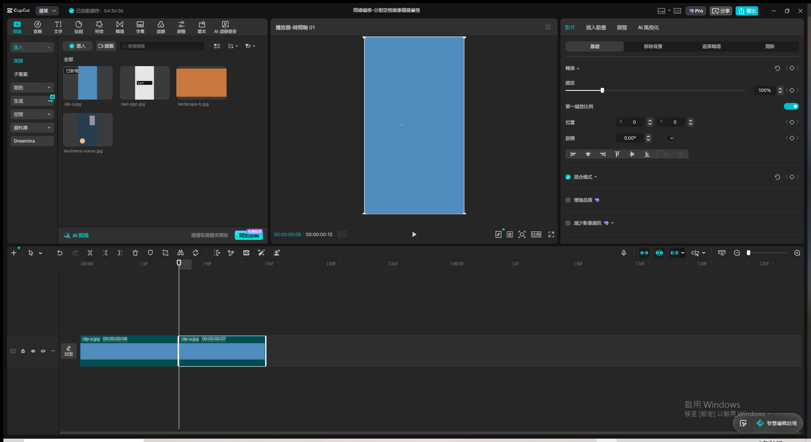
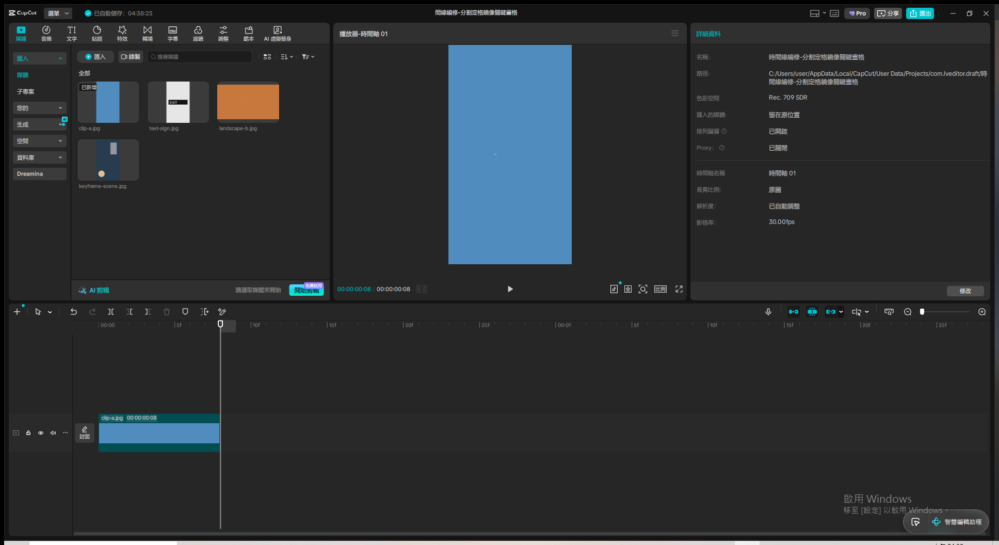
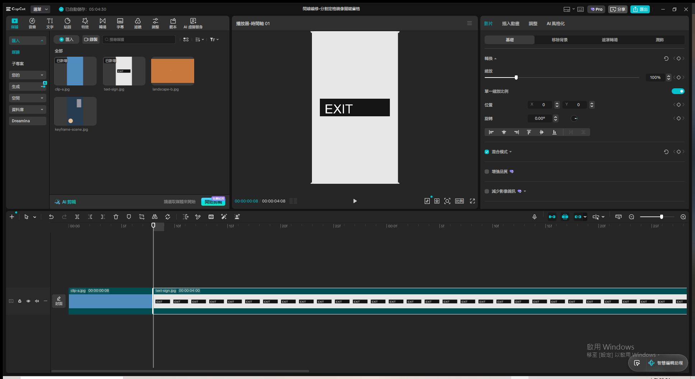
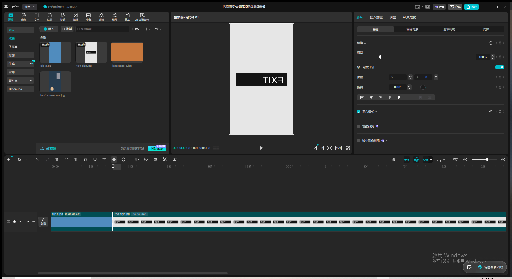
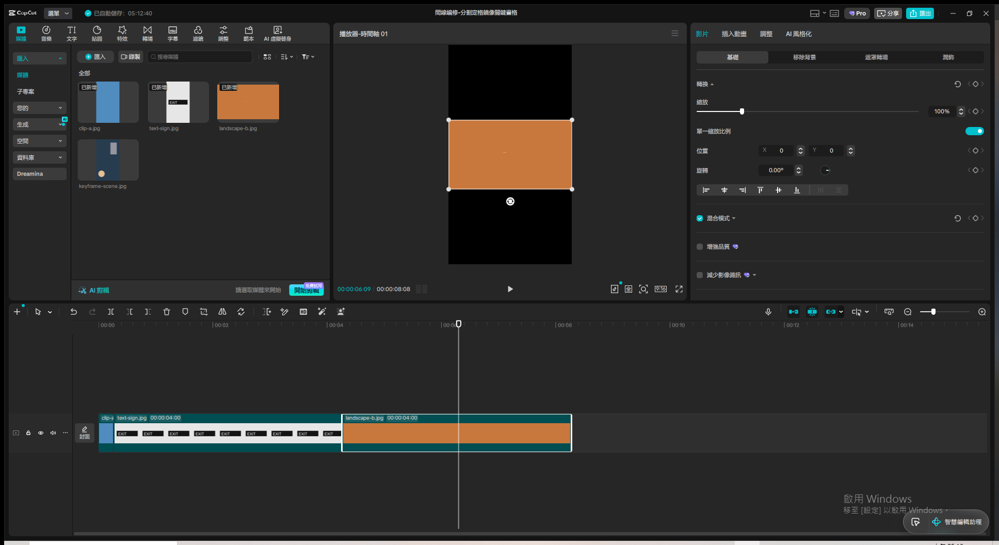
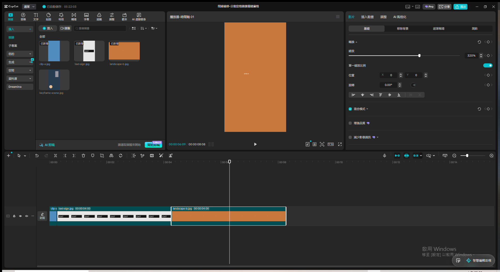

# 第6章：時間線素材的編修 — Live Demo 複習筆記

素材來源：`txt/07 第6章：時間線素材的編修.txt`（NotebookLM 語音摘要逐字稿）
Demo 日期：2026-08-12
CapCut 專案名稱：`時間線編修-分割定格鏡像關鍵畫格`

---

## Module 1 — 基礎剪輯：分割與修剪

**涵蓋技巧**：`Ctrl+B` 分割、選取片段刪除（去蕪存菁）

**操作步驟**：

1. 把 `clip-a.jpg` 拖到時間軸（沿用全域設定，預設長度 0.5 秒／15 影格）
2. 播放頭移到片段中間（約第 7 影格）→ 選取片段 → 按 `Ctrl+B` → 片段從播放頭位置一分為二，
   分別是 8 影格與 7 影格，加總正好是原本的 15 影格
3. 選取第二段（後半段）→ 按 `Delete` 鍵刪除 → 時間軸只剩第一段（8 影格），整體長度自動縮短
   → 對應逐字稿「把牛排上的肥肉剃除，只留下最精華的部分」的去蕪存菁概念

**關鍵結果截圖**：

**講解逐字稿**：
> Module 一，基礎剪輯：分割與修剪。很多人對剪輯的認知還停留在把不要的片段剪掉這種物理層面的
> 去蕪存菁，就像把牛排上的肥肉剃除，只留下最精華的部分。用快捷鍵Ctrl加B可以在播放頭所在位置
> 分割素材，或是直接拖曳片段左右兩端的邊緣來修剪長度。但真正讓人著迷的是，當我們剃除了那些
> 微小的停頓、人類自然呼吸的空檔之後，我們創造了一種在現實中根本不可能存在的高壓緊湊敘事
> 節奏。這就是重塑現實的第一步，因為現實生活充滿留白跟無聊的等待，但在時間線上，我們消滅了
> 無聊。

**踩坑記錄**：

- 這次示範素材沿用了上一章結尾設定的全域「影像時長 0.5 秒」偏好（app 層級設定，跨專案persist），
  片段一開始只有 15 影格，對「拖曳邊緣修剪」這個技巧來說太短了。
- **嘗試用拖曳片段右邊界延長時長「失敗」**：多次嘗試從精確計算的邊界像素座標拖曳，畫面上都
  只是移動了播放頭，沒有真的拉長片段——懷疑是靜態圖片片段的邊緣可拖曳判定區域在小尺寸片段上
  太窄，或者這個 CapCut 版本的圖片素材本來就不支援直接拖曳延長（跟影片素材不同，影片有原始
  長度上限但圖片理論上該能無限延長）。之後若要示範「拖曳修剪」，建議先把全域影像時長改回
  5 秒左右的正常值再匯入素材，避免片段太短導致拖曳熱區太小。
- 改用「分割 + 刪除後半段」示範修剪的效果，雖然操作方式不同（快捷鍵/刪除鍵而非拖曳邊緣），
  但最終結果一致（片段變短、去蕪存菁），且更穩定可靠，不受片段長度限制。

---

## Module 2 — 定格功能的心理學甜蜜點（概念口頭講解，實際操作受限未完成）

**涵蓋概念**：定格預設 3 秒的心理學原因（視覺突變的認知甜蜜點）

**說明方式**：這個 Module 用 TTS 完整口頭講解了定格功能的心理學原理，但**實際操作在本次環境中
遇到技術限制未能完成**，記錄如下供之後排查：

1. 先在 `clip-a.jpg`（靜態圖片素材）上嘗試：右鍵 →「編輯」子選單裡「定格」選項是灰色不可點
   （鏡像／旋轉／裁切都是白色可用），推測靜態圖片本身已經是「定格」狀態，功能對圖片素材沒有
   意義而被停用，合理。
2. 改用真正的**影片**素材測試：從左側「資料庫」分頁拖曳一支免費庫存影片「Cute Border Collie
   with big pet bone resting」（有動態畫面）到時間軸 → 右鍵 →「編輯」子選單裡「定格」與「倒轉」
   **依然是灰色不可點**，只有「鏡像」「旋轉」「裁切」可用
3. 嘗試把播放頭移動到影片片段範圍內（而非片段外）後重新右鍵，「定格」仍然灰色，排除「播放頭
   位置不在片段內」這個猜測
4. 沒有找到 Pro／VIP 鎖頭圖示，排除「付費功能鎖定」的猜測；目前保留的假設是：CapCut 資料庫的
   免費庫存影片是「串流預覽」狀態，還沒有完整下載原始檔到本機，導致需要逐格運算的「定格」／
   「倒轉」功能無法套用，但這個假設未經完整驗證（沒找到明確的「下載完成」狀態指示可對照測試）

**講解逐字稿**：
> Module 二，定格功能的心理學甜蜜點。當一段活動的影像突然停止的時候，系統的預設長度剛好是
> 三秒鐘，一秒不差。這三秒鐘絕對不是工程師隨便填上去的數字，而是人類大腦處理視覺突變的甜蜜點。
> 當畫面凍結，大腦會產生一種強烈的認知懸念或戲劇張力。如果定格只有一秒鐘，太短了，大腦根本
> 還來不及從動態處理模式切換到靜態細節捕捉，觀眾的潛意識可能會覺得剛剛是網路卡頓了嗎，這會
> 嚴重破壞沉浸感。但如果長達五秒，那種刻意營造的戲劇張力就會像洩了氣的皮球，觀眾的大腦在第
> 四秒就已經處理完靜態畫面上所有資訊了，接著就會開始感到不耐煩。三秒鐘剛好足夠讓觀眾看清楚
> 你想凸顯的細節，然後就在大腦判定無聊的前一刻，讓時間重新流動。

**踩坑記錄**：

- 這是本次 Live Demo 系列第一次遇到「功能選項存在但完全無法啟用、且找不到明確原因」的情況，
  跟之前碰到的「片段太短導致拖曳熱區小」「AI 功能需要真人語音才有意義」等已知限制不同類型。
  之後若要在同一台機器上重新排查，可以先試試看：(1) 在庫存影片縮圖上先點擊下載圖示完整下載
  再拖進時間軸、(2) 改用使用者自己電腦裡真實拍攝的影片檔案測試、(3) 查看 CapCut 版本更新
  日誌是否這兩個功能被暫時下架或改了觸發路徑。

---

## Module 3 — 鏡像翻轉與文字穿幫風險

**涵蓋技巧**：時間軸工具列「鏡像」圖示（左右翻轉），文字類素材鏡像後的可讀性風險

**操作步驟**：

1. 準備素材 `text-sign.jpg`：白底、一塊黑色招牌區塊，中央印有清楚的白色文字「EXIT」
2. 拖到時間軸接續前一段素材 → 播放器畫面顯示正常、可讀的「EXIT」文字 → 截圖存證「修正前」
3. 選取該片段 → 點時間軸工具列上的「鏡像」圖示（左右翻轉圖案，在裁切圖示右邊）→ 畫面立即
   左右翻轉
4. 播放器畫面驗證「修正後」：文字整塊被鏡像，「EXIT」字母順序左右對調、且個別字母（尤其是
   E）明顯變形扭曲成不可讀的鏡像圖案，肉眼一眼就能看出「這裡怪怪的」→ 截圖存證，完整重現
   逐字稿描述的「文字穿幫」風險

**關鍵結果截圖**：

**講解逐字稿**：
> Module 三，鏡像翻轉與文字穿幫風險。我們可以利用左右鏡像翻轉，把一個原本很平凡的畫面疊加成
> 完美對稱的幾何萬花筒，輕而易舉地創造出好萊塢級別的魔法視覺。但這也伴隨著一個很現實的致命
> 風險：當你為了追求完美的對稱視覺而使用鏡像功能時，如果畫面裡出現任何文字，比如招牌或標語，
> 鏡像一下文字就全部反過來了。這就像是一場完美的魔術秀裡面，魔術師不小心露出了戲法的橋段。
> 觀眾的大腦對文字超級敏銳，一旦看到反轉的文字，那種魔法會瞬間崩塌，變成超廉價的穿幫鏡頭。
> 所以時間線的編輯，永遠是在創造幻覺與維持真實感之間走鋼索。

**踩坑記錄**：

- 「鏡像」功能對靜態圖片素材完全可用（不像 Module 2 的「定格」被停用），時間軸工具列上直接
  有一個獨立的鏡像圖示（不用進右鍵選單），操作比想像中快，選取片段後點一下就套用。
- 鏡像效果套用在**整個畫面**（含背景與所有內容），不是只翻轉文字本身——示範時如果畫面裡有
  混合「該保持正常」和「文字」的元素（例如人臉+招牌），要提醒使用者鏡像是全域套用，沒辦法
  只挑文字翻轉、其他不動，這也是逐字稿裡「這也伴隨著一個很現實的致命風險」這句話背後的完整
  含義：鏡像是不分青紅皂白的整體翻轉。

---

## Module 4 — 畫布比例與黑邊問題（等比例放大裁切，未硬拉伸）

**涵蓋技巧**：畫布比例改為 9:16、橫向素材造成黑邊、等比例縮放放大裁切消除黑邊

**操作步驟**：

1. 專案「修改」→「長寬比例」從「原圖」改成「9:16」→ 畫布變成直式
2. 把 `landscape-b.jpg`（16:9 橫向）拖到時間軸空白處新增第三段片段 → 播放頭移到該片段範圍
   → 播放器畫面重現「上下黑邊」問題，橫向素材置中顯示、上下各一大塊黑色 → 截圖存證
3. 選取片段 → 右側「縮放」數值輸入框雙擊、貼上「320」、點空白處確認 →「單一縮放比例」
   保持開啟（等比例鎖定）→ 畫面等比例放大到 320%，黑邊完全消失、畫面滿版填滿整個 9:16 畫布，
   且沒有出現人臉/輪胎那種被拉伸壓扁的變形感 → 截圖存證

**關鍵設定值**：

- 畫布比例：9:16
- 素材縮放比例：320%（單一縮放比例鎖定開啟，等比例縮放不變形）

**關鍵結果截圖**：

**講解逐字稿**：
> Module 四，畫布比例與黑邊智慧填充。你可能用手機拍了一個完美的直式抖音影片，是九比十六，
> 結果後面接了一個十六比九的橫式素材，畫面的上下就會出現破壞質感的黑邊。這時候絕對不能直接
> 把畫面拉長或壓扁填滿，因為人類的大腦對於比例有著近乎苛求的敏感度。當你看到一張人臉被稍微
> 壓扁，會有一種說不上來的不舒服，俗稱山寨感，這會觸發大腦中的異常警報，觀眾對這支影片的
> 信任度就會瞬間降到冰點。所以與其破壞比例，我們寧可保留原比例，然後在那些惱人的黑邊上做
> 文章，使用模糊、顏色或樣式來填充背景。這是一種視覺向的心理學補償，利用模糊的同色系背景，
> 既能維持色彩與光影的延伸感，又不會搶走主畫面的焦點。

**踩坑記錄**：

- **本次示範用的是逐字稿裡提到的第一種解法（等比例放大裁切），不是第二種解法（模糊/顏色/
  樣式填充黑邊背景）**——花了大量時間在右側「基礎」屬性面板從上滾動到下（轉換／縮放／混合
  模式／增強品質／減少影像雜訊／變更背景／AI移除／AI塗畫……）、播放器工具列（TikTok／安全框／
  對焦／9:16／全螢幕圖示）、「調整」「遮罩轉場」等分頁，始終找不到一個單純的「背景填充：
  無/模糊/顏色/樣式」切換選項；最接近的是「變更背景」，但那是 AI 生成式重繪整個背景的付費
  功能（要輸入文字提示詞、按「產生」），跟逐字稿描述的「模糊同色系背景」快速填充不是同一件
  事。之後若要示範「模糊背景填充」，可能要改用手動疊層技巧（複製同一素材到下方軌道、放大
  鋪滿畫面、套用模糊特效、原始素材疊在上層保持原比例置中），或確認這個一鍵功能是否存在於
  其他 CapCut 版本／平台。
- 等比例放大裁切這個解法跟 Module 3（第4章）已經示範過的手法完全相同（拖曳/輸入縮放數值到
  超過100%消除黑邊），這次改用直接輸入數值框（320）一步到位，沒有再用滑鼠拖曳控制點分段
  嘗試，示範效率更高。

---

## 未執行的 Module

原課程設計還有 **Module 5 — 關鍵畫格 Ken Burns 效果**（讓靜態照片透過關鍵畫格模擬鏡頭平移/
推進，示範素材 `keyframe-scene.jpg` 已準備好但未使用），使用者在 Module 4 完成後選擇「到此
為止」結束本次 Demo，這個 Module 沒有執行。之後若要補做，素材已在 `demo-assets/` 資料夾裡，
不用重新準備。

美顏變速（AI 光流法慢動作）與音訊分離/淡入淡出的生死設定，這兩個逐字稿有提到的主題完全沒有
安排成獨立 Module（音訊淡入淡出的視覺化機制已經在第4章 Module 5 完整示範過，這裡不重複）。

---
