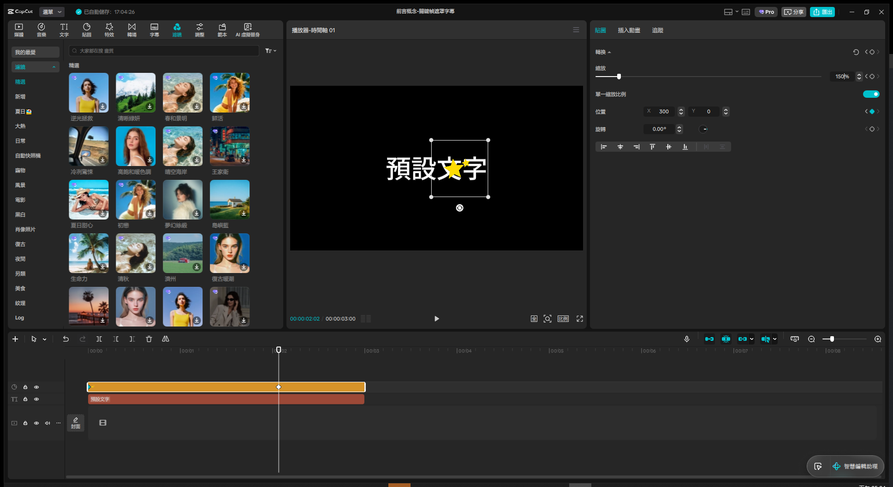
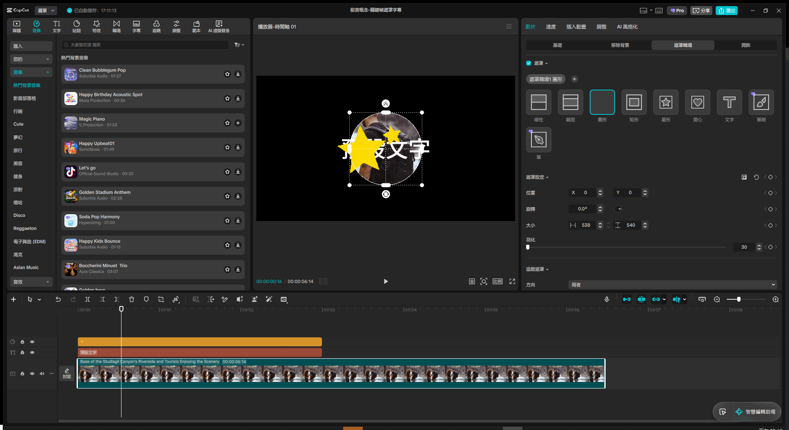
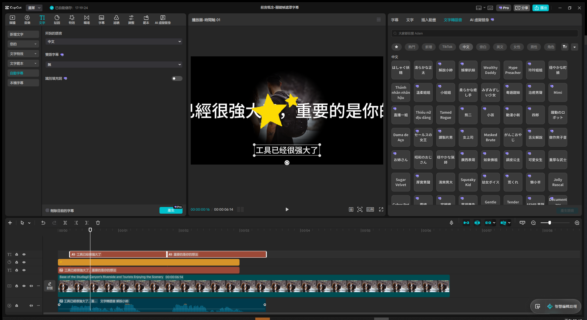

# 前言與目錄 — Live Demo 複習筆記

素材來源：`kindle-45-transcripts/01 前言與目錄.txt`（NotebookLM 語音摘要逐字稿，第四版前言與目錄）
Demo 日期：2026-08-11
CapCut 專案名稱：`前言概念-關鍵幀遮罩字幕`

> 本次逐字稿是「概念導覽」對談，非逐步操作教學，但具體點名 3 個 CapCut 真實功能：關鍵幀、
> 遮罩、自動字幕。以下 3 個 Module 依這 3 個技術點直接示範操作。

---

## Module 1 — 關鍵幀動畫（Keyframe）

**涵蓋技巧**：位置關鍵幀、縮放關鍵幀、關鍵幀間自動插值

**操作步驟**：

1. 「貼圖」分頁 → 熱門素材 → 選一個星星貼圖 → 點縮圖上的「+」加入時間軸（貼圖庫是「先選再加」
   兩段式互動：單擊只預覽，要再點一次冒出的「+」才真的加入）
2. 選取時間軸上的貼圖片段，右側屬性面板「轉換」區塊顯示 縮放／位置／旋轉，每個屬性右側都有
   獨立的「‹ ◇ ›」關鍵幀控制（左右箭頭跳轉前後關鍵幀、菱形是新增/移除關鍵幀）
3. 播放頭停在 00:00（片段起點），設定：位置 X = -300、縮放 = 50%
4. 點擊「縮放」與「位置」的關鍵幀菱形圖示 → 在起點建立第一個關鍵幀（菱形變實心青色）
5. 拖曳／點擊時間軸移動播放頭到約 00:02（片段中段）
6. 設定：位置 X = 300、縮放 = 150% → 因為該屬性已進入關鍵幀模式，改值會**自動**在新的播放頭
   位置建立第二個關鍵幀（不用再手動點菱形）
7. 移動播放頭回到起點與終點之間，確認畫面上的貼圖確實從左小、平滑過渡到右大（CapCut 會疊加
   顯示起點/終點的半透明疊影，方便肉眼確認動畫路徑）

**關鍵設定值**：

- 位置關鍵幀 1（t=0）：X = -300, Y = 0
- 縮放關鍵幀 1（t=0）：50%
- 位置關鍵幀 2（t≈2s）：X = 300, Y = 0
- 縮放關鍵幀 2（t≈2s）：150%

**關鍵結果截圖**：

**講解逐字稿**：
> 這一段我們來示範關鍵幀動畫。關鍵幀就像是幫畫面設路標，只要在起點跟終點各設一個點，電腦會
> 自動幫你算出中間的移動跟縮放軌跡，不用一格一格手動畫。

**踩坑記錄（本次新發現，補進全域 lessons）**：

- CapCut 的數值輸入框（位置 X/Y、縮放 %）**不能用 `keybd_event` 模擬鍵盤直接打數字**，即使是
  純數字/負號也會被目前的鍵盤/IME 狀態吃成亂碼中文字（例如打 `-300` 結果框內出現「爾马」）。
  正確做法跟 CJK 文字輸入完全一致：先 `Set-Clipboard` 把數值字串放進剪貼簿，對輸入框
  `Ctrl+A` 全選、`Ctrl+V` 貼上，再用 `Tab`（或點空白處）確認——不要假設純數字輸入就對鍵盤模擬
  安全。
- 貼圖/文字/特效等素材庫項目的「關鍵幀」控制點分散在**各自屬性的獨立菱形圖示**（縮放/位置/
  旋轉各一個），不是單一全域關鍵幀按鈕；要做位置+縮放同動的動畫需要**兩個屬性都各自點一次
  菱形**才會同時記錄。

---

## Module 2 — 遮罩合成（Mask）

**涵蓋技巧**：影片素材套用形狀遮罩、遮罩位置/大小調整、羽化柔邊

**操作步驟**：

1. 「媒體」分頁 → 左側「資料庫」→ 熱門素材選一段有明確主體的免費影片（本次選「背包旅人」，
   CapCut/Hypic 商業用途素材），點縮圖上的「+」加入時間軸 → 自動落在新的一軌（在既有的貼圖／
   文字軌下方）
2. 選取該影片片段，右側屬性面板「影片」分類下有子分頁：基礎／移除背景／**遮罩轉場**／潤飾——
   「遮罩」功能實際上放在「遮罩轉場」這個子分頁裡（不是獨立的「遮罩」頂層分類，命名容易誤導）
3. 點「+ 新增遮罩」→ 預設是矩形，右側會出現形狀選單：線性／鏡面／圓形／矩形／星形／愛心／
   文字／自訂（筆刷）
4. 點選「圓形」→ 畫面立刻只保留圓形範圍內的影片內容，圓形以外全黑（被遮住）
5. 「遮罩設定」可調：位置 X/Y、旋轉、大小（寬/高）、羽化（邊緣模糊程度）——把羽化從 0 調到 30，
   圓形邊緣從硬邊變成柔和漸層
6. 面板下方還有「追蹤遮罩」區塊（方向：兩者），可讓遮罩自動跟隨畫面中偵測到的主體移動，這是
   逐字稿提到的「AI 影像辨識自動貼合遮罩」對應功能，本次示範沒有深入測試，僅記錄位置供之後
   深化

**關鍵設定值**：

- 遮罩形狀：圓形
- 大小：538 × 540（沿用系統預設，未手動調整）
- 羽化：30

**關鍵結果截圖**：

**講解逐字稿**：
> 接下來示範遮罩。遮罩就像一塊挖了洞的厚紙板，蓋在畫面上，只有洞口露出來的部分看得到，其他
> 都被蓋住。常拿來做去背、局部顯示，或者人從牆裡走出來這種特效。

**踩坑記錄（本次新發現）**：

- CapCut 桌面版的「遮罩」功能**不是獨立頂層分類**，藏在影片/圖片屬性面板的「遮罩轉場」子
  分頁裡（在 基礎／移除背景／**遮罩轉場**／潤飾 這一排），第一次找容易誤以為只跟轉場有關而
  跳過。
- 資料庫（媒體庫）的影片/照片素材是**單擊直接顯示「+」**加入時間軸，不需要像貼圖/文字庫那樣
  先單擊預覽、再單擊一次才冒出「+」——兩種素材庫的兩段式互動深度不同，操作前先觀察一次縮圖
  hover 狀態比較保險。

---

## Module 3 — 自動字幕（Auto Captions）

**涵蓋技巧**：文字轉語音（TTS）生成配音、自動字幕辨識、字幕與音軌自動同步

**操作步驟**：

1. 因為素材來源是純文字逐字稿（沒有現成的人聲影片可剪），改用 Phase 2「次選」策略：把時間軸
   上既有的「預設文字」內容改成一句有意義的句子（本次用「工具已經很強大了，重要的是你的想法」，
   取自逐字稿結尾的核心論點）
2. 選取該文字片段 → 右側頂層分頁切到「文字轉語音」→ 篩選「中文」語音 → 選一個聲線（本次用
   「解說小廚」）→ 點「產生語音」→ CapCut 自動在時間軸新增一條音訊軌，內容就是這段文字的
   AI 語音
3. 選取剛生成的語音片段 → 左側「文字」分頁 → 左側子選單「自動字幕」→ 「所說的語言」選中文、
   雙語字幕選無 → 點「產生」
4. 幾秒內時間軸自動新增一條「字幕」軌，依語音的實際停頓自動切成 2 段：「工具已经很强大了」／
   「重要的是你的想法」，播放器畫面下方即時顯示燒錄字幕，時間軸上的字幕區塊與音訊波形完全對齊

**關鍵設定值**：

- TTS 語音：解說小廚（中文）
- 自動字幕語言：中文
- 雙語字幕：無
- 識別填充詞：關閉

**關鍵結果截圖**：

**講解逐字稿**：
> 最後示範自動字幕。先用文字轉語音功能生一段真人配音，再交給智能字幕辨識，聽一句打一句、還
> 自動對齊時間軸的痛苦工作，現在幾秒鐘就搞定。

**踩坑記錄（本次新發現）**：

- 沒有現成人聲素材時，「文字轉語音」+「自動字幕」可以串成一條完整鏈路自我測試：不需要額外去
  外部找語音檔，直接在 CapCut 內生成配音再餵給字幕辨識，兩個功能剛好互補成一個可獨立驗證的
  demo 迴圈。
- 自動字幕辨識出的文字是**簡體字**（「工具已经很强大了」），即使來源文字圖層打的是繁體中文
  （「工具已經很強大了」）、TTS 語音也是聽起來標準的中文發音——語音辨識模型的輸出字集跟輸入
  文字的字集是分開的兩件事，繁中素材過語音辨識鏈路要有心理準備字幕結果可能跑出簡體字，需要
  的話得再手動或用其他工具轉換。
- 「文字轉語音」是**文字圖層專屬**的頂層分頁（跟「文字」「插入動畫」「追蹤」同排），只有選取
  文字類型的片段時才會出現，不要在影片/貼圖片段上找這個分頁。
